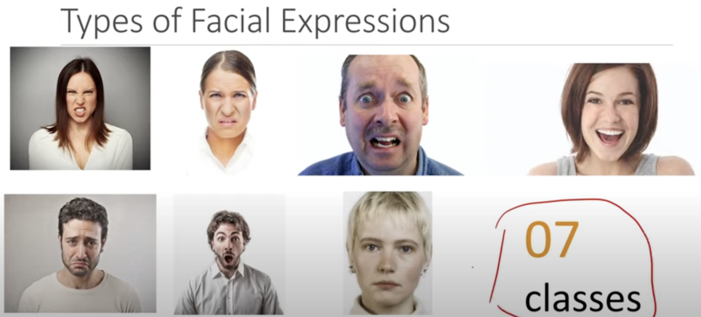

# Face Emotion Recognition using Transfer Learning

### How to find Facial Expressions?

 - Vision based Techniques - Camera
 
 Range from 0 to 1 so **intensity** can be understood

 - Bio Signals / Physiological
    - PPG
    - ECG
    - EEG
 
    **Called as Human Emotions Recognition**

## Working with 7 classes

- Angry
- Disgusting
- Fear
- Happy
- Sad
- Surprised
- Neutral

